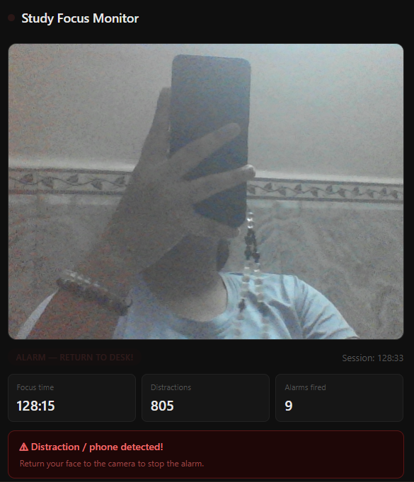
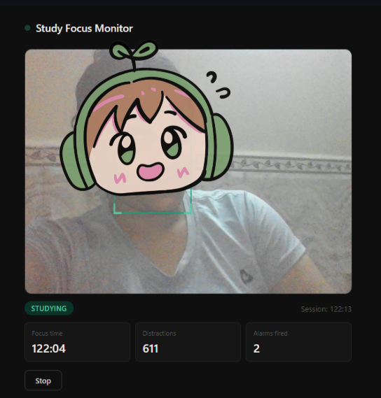
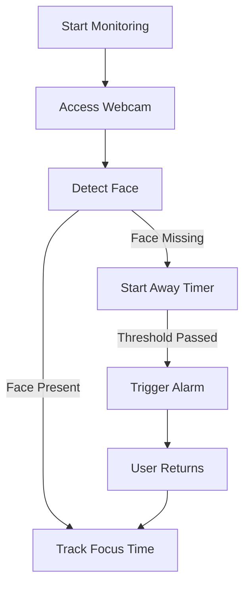

# 🎯 Study Focus Monitor

<p align="center">
  <b>Stay focused. Eliminate distractions. Train your discipline.</b><br>
  A real-time webcam-based study tracker powered by face detection.
</p>

<p align="center">
  
  
  
  
</p>

---

## 📸 Preview






---

## ✨ Features

* 🎥 **Live Webcam Monitoring**
* 🧠 **AI Face Detection (MediaPipe)**
* ⏱️ **Focus Time Tracking**
* ⚠️ **Distraction Detection**
* 🔔 **Smart Alarm System**
* 📊 **Real-time Stats Dashboard**
* ⚙️ **Customizable Threshold**
* 🔒 **100% Local Processing (Privacy-first)**

---

## ⚡ Quick Start

```bash
# Clone the repo
git clone https://github.com/your-username/study-focus-monitor.git

# Open folder
cd study-focus-monitor
```

👉 Then simply open:

```bash
index.html
```

No build. No dependencies. Just run.

---

## 🧠 How It Works



---

## 🖥️ Usage

1. Click **Start Monitoring**
2. Allow camera permission
3. Stay in frame while studying
4. Look away → distraction counted
5. Stay away too long → 🚨 alarm triggered
6. Return to screen → alarm stops automatically

---

## ⚙️ Configuration

| Setting        | Description                | Default |
| -------------- | -------------------------- | ------- |
| Away Threshold | Time before alarm triggers | 3 sec   |

---

## 🧩 Tech Stack

* **Frontend:** HTML5, CSS3, JavaScript
* **AI Engine:** MediaPipe Face Detection
* **APIs:** WebRTC (getUserMedia), Canvas API

---

## 🔒 Privacy

✔ No data collection
✔ No video storage
✔ No server communication

Everything runs **locally in your browser**

---

## ⚠️ Limitations

* Low-light environments reduce accuracy
* Face must be clearly visible
* Extreme angles may not be detected
* Fallback motion detection is less precise

---

## 🚀 Future Roadmap

* 📱 Mobile optimization
* 📊 Session history & analytics
* 🍅 Pomodoro mode
* 🤖 Phone / distraction object detection
* 🌙 Theme customization

---

## 🤝 Contributing

Contributions are welcome!

```bash
# Fork the repo
# Create a new branch
git checkout -b feature-name

# Commit changes
git commit -m "Add feature"

# Push
git push origin feature-name
```

Then open a Pull Request 🚀

---

## ⭐ Support

If you like this project:

👉 Give it a **star**
👉 Share it with others

---

## 📄 License

MIT License — feel free to use and modify

---

## 👨‍💻 Author

**Shreya**

---

## 💡 Pro Tip

Use this tool during:

* Study sessions 📚
* Deep work 💻
* Exam preparation 🧠

Consistency beats motivation.
